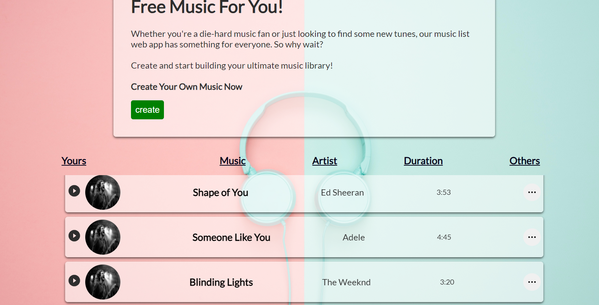

# CRUD Operations with React.js, Redux Toolkit, Redux Saga, Emotion, Styled System, and Firebase

This is a template for a React.js application that performs CRUD (Create, Read, Update, Delete) operations using Redux Toolkit, Redux Saga, Emotion, Styled System, and Firebase. The application allows users to manage data by creating, reading, updating, and deleting items. It utilizes modern frontend technologies and a cloud-based database to provide a seamless user experience.



## Technologies Used

The application is built using the following technologies:

- React.js
- Redux Toolkit
- Redux Saga
- Emotion
- Styled System
- Firebase

## Prerequisites

Before running the application, ensure that you have the following:

- Node.js and npm installed on your machine.
- A Firebase project set up with Firestore database enabled.

## Getting Started

Follow the steps below to set up and run the application:

1. Clone the repository to your local machine:

   ```bash
   git clone https://github.com/Lykamopia/Custom-music-app.git
   ```

2. Navigate to the project directory:

   ```bash
   cd Custom-music-app
   ```

3. Install the dependencies:

   ```bash
   npm install
   ```

4. Configure Firebase:

   - Create a Firebase project on the [Firebase Console](https://console.firebase.google.com/).
   - Enable Firestore database in your Firebase project.
   - Obtain your Firebase configuration values.
   - Create a `.env` file in the root directory of the project and add the following:

     ```
     apiKey=YOUR_API_KEY
     authDomain=YOUR_AUTH_DOMAIN
     projectId=YOUR_PROJECT_ID
     storageBucket=YOUR_STORAGE_BUCKET
     messagingSenderId=YOUR_SENDER_ID
     appId=YOUR_APP_ID
     ```

     Replace `YOUR_API_KEY`, `YOUR_AUTH_DOMAIN`, etc., with your actual Firebase configuration values.

5. Start the development server:

   ```bash
   npm start
   ```

6. Open a web browser and visit `http://localhost:3000` to view the application.

## Usage

- The application allows you to manage items through CRUD operations.
- Click the "Add Item" button to add a new item. Fill in the necessary details and click "Add" to create the item.
- To edit an item, click the "Edit" button, update the details, and click "update" to apply the changes.
- To delete an item, click the "Delete" button 

## Folder Structure

The project structure follows a common convention for React.js applications:

```
|-- src
    |-- app
    |-- assets
    |-- components
    |-- features
    |-- App.js
    |-- index.js
```

## Contributing

Contributions to this project are welcome. If you find any bugs or want to add new features, please open an issue or submit a pull request.

## Acknowledgments

- This project leverages the power of React.js and various libraries to simplify development and enhance the user interface.
- Special thanks to the maintainers and contributors of the React.js, Redux Toolkit, Redux Saga, Emotion, Styled System, and Firebase projects.

## Contact

If you have any questions or suggestions, feel free to reach out to

 us at [alex94lykam@gmail.com](alex94lykam@gmail.com).

Happy coding!
